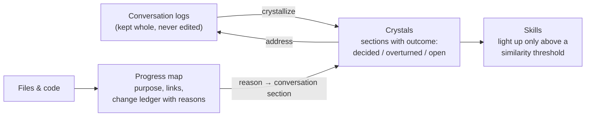

# MeaningSpace

**Keep every word. Load only the meaning.**

A local memory layer for people who work with an AI all day, every day.
The full conversation log is never summarized away. A meaning layer with **line-level addresses** sits on top of it, so a new session pulls in only the few sections it needs — and can still walk back to the exact lines they came from.

-yellow)

---

## The problem

Every new AI session starts from zero. You explain the architecture again. The agent retries the fix that already failed last week. Rebuilding context burns your usage limit before any real work starts.

Today there are two common answers, and both hurt:

| Approach | What happens |
|---|---|
| **Summarize and discard** | Fits in context, but the original reasoning is gone. When your understanding changes, there is nothing to go back to. |
| **Reload everything / grep the files** | Nothing is lost, but every question costs a pile of reading — and keyword search often lands in the wrong file. |

MeaningSpace takes a third path: **keep the ground, carry the meaning.**

## How it works

1. **Ground** — every conversation is stored as a line-numbered log. Nothing is deleted or rewritten.
2. **Crystals** — each conversation is distilled into sections. Every section carries its outcome (*decided / overturned / open*) and the **addresses of the log lines** it came from. Addresses are *selected from a closed candidate set*, not recalled by the model.
3. **Skills** — working procedures are stored as crystals too. A search returns only a title and a query to descend; the body is read only when a skill clears the threshold. Adding skills does not grow every prompt.
4. **Progress map** — files and code get the same treatment: what each file is for, what it links to, and a change ledger where every edit carries a reason and a reverse patch tied to the conversation section that caused it.

Everything — text, vectors, a lexical index, addresses and the map — lives in **one DuckDB file**, so a single query can go from *meaning → section → log line → file → reason for the change*.

## What survives 60 days later

Both approaches keep you from re-explaining everything. The difference is what is still there when a question comes up that nobody expected.

| | Claude Code auto memory | MeaningSpace |
|---|---|---|
| What gets written | Notes Claude decides are worth keeping, while it works | Every conversation, crystallized section by section |
| When "important" is decided | At write time | At read time |
| Original conversation logs | Deleted after the retention period | Kept whole, never edited |
| Can you go back to the exact lines? | Only if the log still exists | Yes — every section carries line addresses |
| Overturned decisions | Stale notes are merged or dropped when noticed | Each section is marked *decided / overturned / open* |
| Loaded at session start | First 200 lines or 25 KB of the index | Only the sections the question pulls in |

Sources for the left column: [Claude Code docs — How Claude remembers your project](https://code.claude.com/docs/en/memory).

Auto memory is good at what it noticed at the time. MeaningSpace is built for what turns out to matter later: the essence of a long history, the decision that was reversed, and the exact line it came from.

## In daily use

- **2,405** conversation crystals over **3,036** logs
- **74** active skills
- Used every day on a Claude Max 5x plan
- Search is lexical (BM25) + vector, fused by rank; an optional GPU reranker sorts the final candidates

## What is (and isn't) here

This repository is a **dated public record of the design**, not an installable package. The implementation is not published.
If you want to build something like it, or talk about using it in a team, reach out through **[subtractlab.com](https://subtractlab.com)**.

**Related work.** [Graphiti](https://github.com/getzep/graphiti) also keeps raw input as episodes and traces facts back to them. MeaningSpace differs in what it puts on top: narrative crystals and behavior-changing skills rather than an entity graph, with addresses down to the line.

**More:**
[MeaningSpace overview](https://subtractlab.com/meaningspace) · [Architecture (illustrated)](https://subtractlab.com/architecture.html) · [3Gravity](https://subtractlab.com/3gravity) · [QIS](https://subtractlab.com/qis) · [DP Multi-Agent](dp-multiagent.md) · [Products](https://subtractlab.com/products) · [Prior-art timeline](timeline.md) · [FAQ](https://subtractlab.com/faq)

---

## Vision

1. **The AI's workspace, not the human's** — instead of putting AI inside human tools, people enter the AI's meaning space through conversation.
2. **Memory becomes reasoning** — every crystal carries its own judgment (what worked, what failed, what was overturned), and that judgment is used at retrieval time.
3. **AI-native organizational OS** — personal meaning spaces first; the *who* of every crystal is already stored as a column, so groups and organizations can share a common layer later.

## Other projects

All built through conversation on MeaningSpace. See **[Products](https://subtractlab.com/products)**.

- **φMovie** — automated video production pipeline
- **BIApps** — serverless BI on shared storage + local DuckDB
- **POS RPA** — daily automated back-office operations
- **φPPT** — golden-ratio, AI-native presentation design
- **AutoCrystallize** — self-maintaining memory pipeline
- **VoiceMode** — spoken conversation interface (VOICEVOX)

## Changelog (dated anchors)

| Date | Milestone |
|---|---|
| 2026-06-06 | First public anchor — brand & site launch |
| 2026-07-08 | Self-learning pipeline + SelfRepair design |
| 2026-07-13 | DP multi-agent foundation |
| 2026-07-16 | Public disclosure: architecture.html / history.html / dp-multiagent.md / timeline.md |
| 2026-09-01 | SweepSearch retired; search moved to lexical + vector fusion with descend |
| 2026-09 | Line-level addresses for every crystal section (closed-set selection) |
| 2026-10-04 | Progress map: file map + change ledger with reasons and reverse patches |

Full dated history: **[timeline.md](timeline.md)**

## Author

**奥田剛司 (Koji Okuda)** · Independent builder. Subtractive design practitioner.

[subtractlab.com](https://subtractlab.com) · [@subtractlabo](https://x.com/subtractlabo) · [@SUBTRACTLAB](https://www.youtube.com/@SUBTRACTLAB) · [note.com/subtractlab](https://note.com/subtractlab)

*First public anchor: June 6, 2026. This README and all pages are timestamped by git commit history.*
